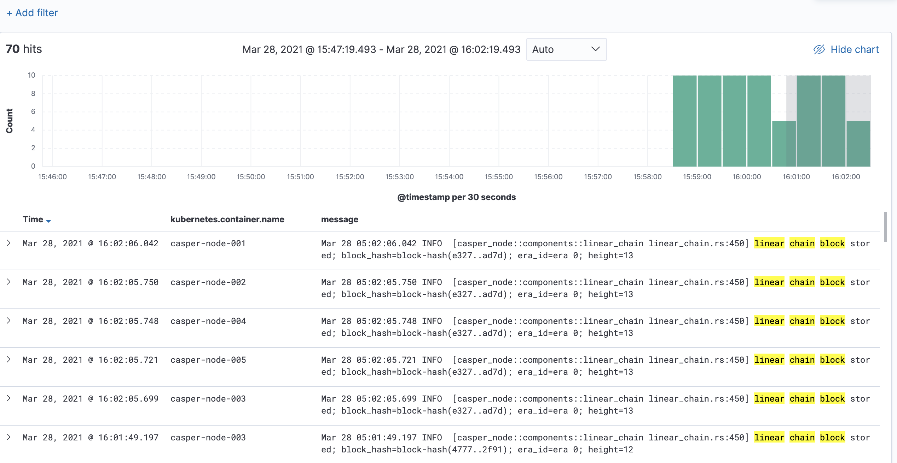

# casper-kube

Run a [casper-tool](https://github.com/dwerner/casper-test-ansible/blob/main/casper-tool.py) generated network on Kubernetes using your current dev build on a network of arbitary size (Node Count) and resource requests (CPU/Mem/Storage). 

Kubernetes will autoscale the cluster to meet the resources requested.


### Requirements


* Request access to the cluster from SRE (AWS user added to eks_test [Cluster Auth ConfigMap](https://github.com/CasperLabs/sre/blob/master/kubernetes/clusters/test/config-map-aws-auth.yaml) and RW access to s3://builds.casperlabs.io)
* Ensure you have AWS keys setup in `~/.aws/config`
* Install [aws-iam-authenticator](https://docs.aws.amazon.com/eks/latest/userguide/install-aws-iam-authenticator.html)
* Install eks_test [kubeconfig](https://github.com/CasperLabs/sre/blob/master/terraform/kubernetes/test/kubeconfig_test) at `~/.kube/config`
* Install [kubectl](https://kubernetes.io/docs/tasks/tools/install-kubectl/) and [Lens](https://k8slens.dev/) 


see [Confluence Kubernetes docs](https://casperlabs.atlassian.net/wiki/spaces/OPS/pages/1034584065/Kubernetes)


The following repositories must be checked out at the same level

```
casper-kube
casper-node
casper-node-launcher
```


#### Usage

**kube-hosts.yaml** defines the network. eg.

```
all:
  children:
    bootstrap:
      hosts:
        casper-node-001: ''
    validators:
      hosts:
        casper-node-002: ''
        casper-node-003: ''
    zero_weight:
      hosts:
        casper-node-004: ''
        casper-node-005: ''
```

**Create a network**

* `casper-node` & `casper-node-launcher` binaries must be built before running `create-kube-network` 
* `node_count option` must match the number of nodes defined in kube-hosts.yaml
* `genesis_in_seconds option` must be longer than the time taken to spin up the network to a running state. (A higher node count will require a higher delay until genesis)


```
cp kube_hosts_examples/kube-hosts-5.yaml ./kube-hosts.yaml
./create-kube-network --node_count 5 \
                      --node_cpu 2 \
                      --node_mem 2Gi \
                      --node_storage 10Gi \
                      --genesis_in_seconds 300

cp kube_hosts_examples/kube-hosts-50.yaml ./kube-hosts.yaml
./create-kube-network --node_count 50 \
                      --node_cpu 1 \
                      --node_mem 500Mi \
                      --node_storage 1Gi \
                      --genesis_in_seconds 900

```


**View network in Lens**

Navigate to `Workloads -> Pods` and selected the generated network from the Namespace dropdown menu. eg. `rob-cb1d20ad-c6ed`


**View logs / Get Shell / Monitoring**

Use Pod context menu (top right shelf icons)


**View logs in Kibana**

`create-kube-network` will output a link to Kibana with logs scoped to the newly created network



**Deleting a Network**

Navigate to `Namespaces` and delete the network. 

All resources associated with the network (pods, volumes) will be removed and the cluster will scale down.


### Chaos

Nodes are launched on Kubernetes workers running on AWS Spot Instances (leveraging ~90% cost savings). 

In the event a Spot Termination occurs (workers will typically stay up for weeks at a time) the terminated `casper-node` Pod will be rescheduled on another Kubernetes worker. 

The `/storage` volume is persistent and survives the reschedule. 